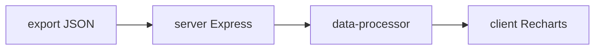

# Metricon

Quiz and drill performance console. Ingest exported browser submission JSON,
compute accuracy and attempt metrics, and render filters plus charts in a React
client with a thin Express host.

## Architecture



## Quick start

```bash
git clone https://github.com/Aneesh495/metricon.git
cd metricon
npm install
npm run dev
```

## Scripts

| Command | Purpose |
| --- | --- |
| `npm run dev` | Client + API with hot reload |
| `npm run build` | Production bundles |
| `npm run start` | Serve compiled server |
| `npm run check` | TypeScript check |

## Layout

- `client/` - dashboard, filters, charts
- `server/` - API and static hosting
- `shared/` - shared types

## License

MIT
