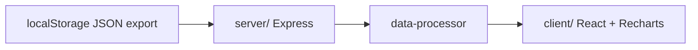

# LocalStorageStats

Quiz performance dashboard that ingests exported browser `localStorage` submission
JSON, aggregates accuracy and attempt metrics, and renders interactive charts in
a React client backed by a thin Express API.

## Architecture



## Quick start

```bash
git clone https://github.com/Aneesh495/LocalStorageStats.git
cd LocalStorageStats
npm install
npm run dev
```

Open the URL printed by the dev server (default port 5001).

## Scripts

| Command | Purpose |
| --- | --- |
| `npm run dev` | Vite client + API with hot reload |
| `npm run build` | Production bundles |
| `npm run start` | Serve compiled server |
| `npm run check` | TypeScript check |

## Layout

- `client/` - dashboard, filters, chart components
- `server/` - ingestion endpoints and static hosting
- `shared/` - shared types

See `docs/ARCHITECTURE.md` for data flow detail.

## License

MIT
