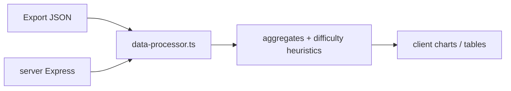

# Metricon

Analytics dashboard for quiz and drill exports: paste or load browser JSON snapshots, normalize attempts in `data-processor.ts`, and drive Recharts views (accuracy, streaks, per-question breakdown). Express hosts the API and production static bundle; Vite builds the client.

## Pipeline



Typical inputs mirror `localStorage` submission history: attempt timestamps, correctness, question ids, and optional metadata from practice sites. The server path is thin; most aggregation runs in shared TypeScript used by the client.

## Monorepo build

| Script | Output |
| --- | --- |
| `npm run dev` | `tsx server/index.ts` + Vite HMR on client |
| `npm run build` | Vite client to `dist/public`; esbuild server bundle to `dist/` |
| `npm run start` | Node serves API + static assets |
| `npm run check` | Full-project `tsc` |

Shared types in `shared/` keep API responses aligned with UI hooks (`use-quiz-data.tsx`).

## Run

```bash
git clone https://github.com/Aneesh495/metricon.git
cd metricon
npm install
npm run dev
```

Default dev URL is printed on startup (commonly port **5001**).

## Layout

| Path | Role |
| --- | --- |
| `client/src/utils/data-processor.ts` | Normalization + metric derivations |
| `client/src/components/` | Stats overview, performance insights, charts |
| `server/index.ts` | Express entry, Vite middleware in dev |
| `shared/` | Types shared across tiers |

## CI

GitHub Actions: `npm ci`, `npm run check` on push/PR.

## License

MIT
