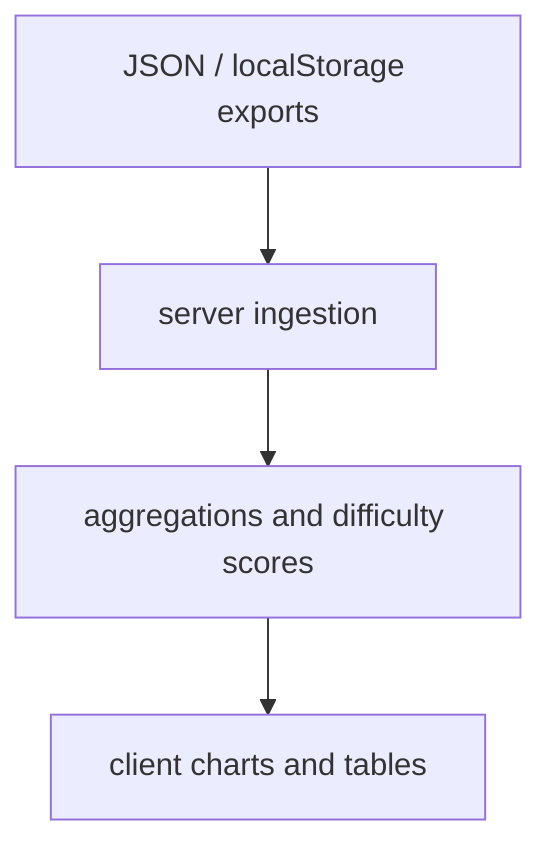

# Metricon

Metrics console for quiz and drill performance: same Express + Vite monorepo
pattern as LocalStorageStats, tuned for longitudinal tracking, difficulty
scoring, and export-friendly aggregates recruiters can skim in a demo.

## Architecture



## Quick start

```bash
git clone https://github.com/Aneesh495/metricon.git
cd metricon
npm install
npm run dev
```

## Differentiation

| Concern | Metricon focus |
| --- | --- |
| Time series | Progress and rolling accuracy |
| Question drill-down | Per-item attempt counts and correctness |
| Export | CSV-friendly tables for external analysis |

## License

MIT
