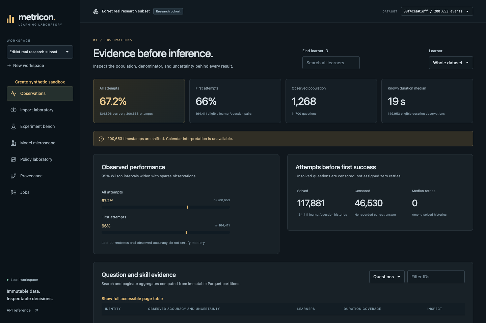

# Metricon

Metricon is a local learning analytics laboratory. It connects immutable practice records, leakage-safe history features, calibrated prediction and inspectable study decisions. SQLite owns transactional metadata, Parquet owns canonical observations, and independent DuckDB/Polars connections serve a React scientific workbench.

An answer is an observation. A final correct answer does not certify mastery. Empty workspaces stay empty. Synthetic demonstrations require an explicit action and retain a separate workspace label. Original browser exports preserve question-local order because they contain no real timestamps.



This is the running local application over the recorded EdNet subset. The screenshot shows aggregate evidence; it is not a substitute for the frozen research artifacts.

## Start in five minutes

Requires Python 3.13, Node 24 and uv on macOS or Linux. Python and Node dependencies are locked. The built wheel includes the production workbench and dependency lock.

```bash
make bootstrap
.venv/bin/metricon serve --port 8000
```

Open [the local workbench](http://127.0.0.1:8000). Create a workspace, upload an existing export, preview its schema, inspect rejections and commit the import. The service binds to loopback. The explicit synthetic sandbox action provides a self-contained example.

```bash
make demo
make dev
```

The development workbench runs at [port 5173](http://127.0.0.1:5173) with an API proxy to 8000. Stop an existing production server before starting `make dev`. The runner propagates startup failures and stops its own child process groups.

## Follow the evidence

The workbench has import/quality inspection, dataset and learner filtering, question/skill tables, uncertainty and sequence views, real cohort eligibility, experiment comparison, calibration, model replay, lineage, planning, simulation and persistent task inspection. Model-derived views identify their dataset and run. Tables are paginated and virtualized with a complete accessible page alternative; charts retain eligible denominators and uncertainty.

The [working CLI sequence](docs/API_CLI.md) creates a dataset, fits an experiment, recomputes frozen metrics, compares models, plans a session and exports accepted observations. CLI and API call the same packaged behavior.

| Stage | Implemented contract |
| --- | --- |
| [Ingest](src/metricon/ingest/pipeline.py) | Bounded JSON, original question-keyed JSON, CSV, NDJSON, Parquet and EdNet adapters. Strict booleans, source identities, checksummed originals and explicit quarantine. Exact duplicates are idempotent; changed content under an existing ID is a conflict. |
| [Store](src/metricon/storage/catalog.py) | Immutable versions, exact disk identity indexes and transactional manifest pointers. Interrupted publication exposes a previous or complete dataset. Workers return hashed outputs to one metadata coordinator. |
| [Analyze](src/metricon/analytics/engine.py) | First/all-attempt accuracy, Wilson intervals, real streaks, censored retries, scoped duration statistics, sessions and supported cohort comparisons. Unknown groups remain unknown. |
| [Model](src/metricon/models) | Constant, item-prior, recent-history and regularized logistic baselines; fitted BKT; hierarchical Beta-Binomial performance; eligible regularized 1PL/2PL cohort IRT. |
| [Evaluate](src/metricon/evaluation/experiment.py) | Whole-unit forward, learner-held-out and rolling splits; training-only preprocessing; validation selection/calibration; frozen probabilities; learner-cluster intervals; same-row paired comparisons and retained ablations. |
| [Plan](src/metricon/recommendation/planner.py) | Observed history, uncertainty, priorities, prerequisites, repetition penalties and optional saved BKT state. Time allocation requires observed eligible duration support. |
| [Simulate](src/metricon/simulation/campaign.py) | Matched seeds and equal budgets across five policies, four latent regimes and a deliberately misspecified process, with complete trajectories. |

## Reproduce the research and measurements

```bash
make test
make test-integration
make test-e2e
make dataset-public
make experiment
make benchmark
make acceptance
make verify
```

The full campaign takes longer than fast checks. It runs adversarial imports, independent analytical references, actual interruption/restart cases, every scale repetition, fixed synthetic comparisons, public research, simulations and browser workflows. `verify` checks existing evidence without regenerating it. Missing or changed evidence fails.

The deterministic EdNet KT1 subset has 200,653 valid interactions from 1,268 learners. Its [dataset card](docs/PUBLIC_DATA.md) records acquisition, exclusion and shifted-time semantics. The [research report](docs/reports/RESEARCH.md) retains all baselines, calibration and ablations, including weak IRT results. The [performance report](docs/reports/PERFORMANCE.md) records raw repetitions, RSS, query distributions and unmet throughput objectives. Predictive quality and performance objectives remain separate from system correctness.

## Read the contracts

- [Architecture and data ownership](docs/ARCHITECTURE.md), [schema and adapters](docs/SCHEMA.md), [metric glossary](docs/METRICS.md).
- [Feature leakage rules](docs/FEATURES.md), [model derivations](docs/MODELS.md), [model cards](docs/MODEL_CARDS.md).
- [Experiment reproduction](docs/REPRODUCIBILITY.md), [simulation assumptions](docs/SIMULATION.md), [source and scientific review](docs/reports/REVIEW.md).
- [Task/recovery runbook](docs/TASKS.md), [API/CLI reference](docs/API_CLI.md), [ADRs](docs/adrs), [build status](docs/BUILD_STATUS.md).

Artifacts, databases, downloaded archives and raw public learner records live in ignored local storage. No hosted service or model API is required. MIT applies to Metricon source; public datasets retain their own terms. EdNet is attributed to the original [Riiid repository](https://github.com/riiid/ednet) and used under its research license.
