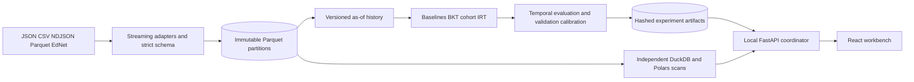
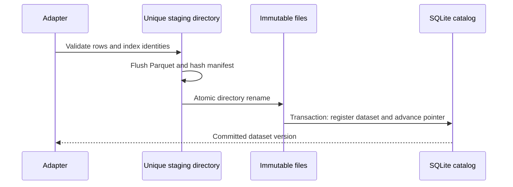

# Architecture and ownership

SQLite owns workspace pointers, identity indexes, import reports, task states, artifact registrations, and lineage edges. Parquet owns canonical events. Experiments own fitted parameters, frozen predictions, calibration, and reports. The browser owns selection state and explicit migration backups, never canonical records.

Imports acquire a workspace lock, write bounded chunks and an on-disk identity staging index, and publish under one metadata transaction. A complete renamed directory without a committed pointer is an orphan, not a visible dataset. Recovery removes unregistered staging and publication directories while holding exclusive operational locks.

Workers read committed partitions and write unique artifact directories. There is no writable shared DuckDB database. Each query has its own in-memory analytical connection with a bounded memory limit and explicit thread count. Catalog writes use short SQLite transactions. The API coordinator owns metadata publication. Bounded subprocess workers use read-only catalog connections and return hashed output manifests. The [task runbook](TASKS.md) defines cancellation, wall-time limits, and restart behavior.

Source-linked entry points: [import_file](../src/metricon/ingest/pipeline.py), [Catalog](../src/metricon/storage/catalog.py), [ArtifactWriter](../src/metricon/storage/artifacts.py), [as-of features](../src/metricon/features/history.py), [run_experiment](../src/metricon/evaluation/experiment.py), and [create_app](../src/metricon/api/app.py).
