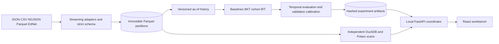
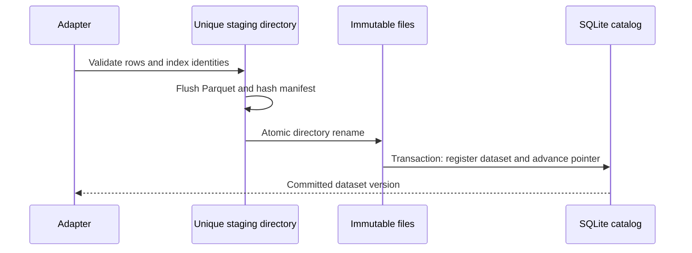
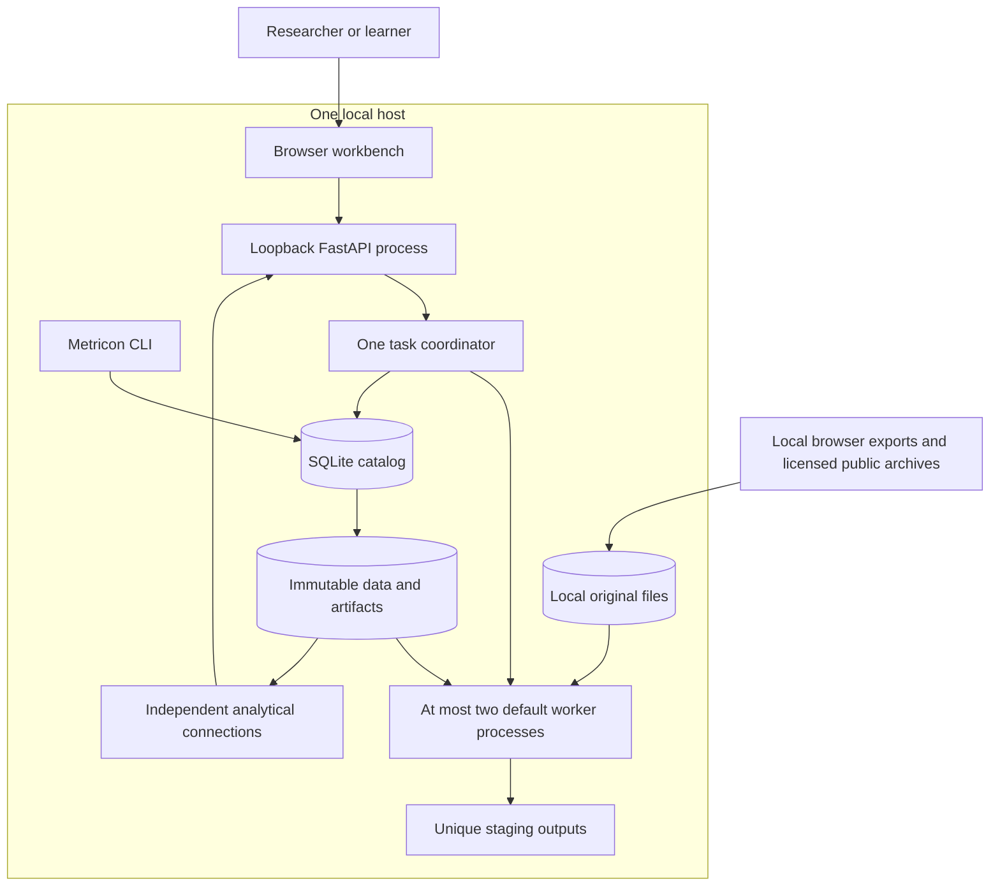
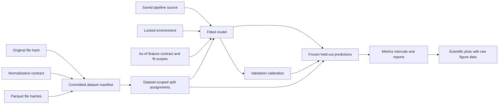

# Architecture and ownership

SQLite owns workspace pointers, identity indexes, import reports, task states, artifact registrations, and lineage edges. Parquet owns canonical events. Experiments own fitted parameters, frozen predictions, calibration, and reports. The browser owns selection state and explicit migration backups, never canonical records.

Imports acquire a workspace lock, write bounded chunks and an on-disk identity staging index, and publish under one metadata transaction. A complete renamed directory without a committed pointer is an orphan, not a visible dataset. Recovery removes unregistered staging and publication directories while holding exclusive operational locks.

Workers read committed partitions and write unique artifact directories. There is no writable shared DuckDB database. Each query has its own in-memory analytical connection with a bounded memory limit and explicit thread count. Catalog writes use short SQLite transactions. The API coordinator owns metadata publication. Bounded subprocess workers use read-only catalog connections and return hashed output manifests. The [task runbook](TASKS.md) defines cancellation, wall-time limits, and restart behavior.

Source-linked entry points: [import_file](../src/metricon/ingest/pipeline.py), [Catalog](../src/metricon/storage/catalog.py), [ArtifactWriter](../src/metricon/storage/artifacts.py), [as-of features](../src/metricon/features/history.py), [run_experiment](../src/metricon/evaluation/experiment.py), and [create_app](../src/metricon/api/app.py).

## System context and local deployment

The production service serves compiled browser assets and the API from one loopback origin. Development runs Vite on 5173 with its API proxy and Python on 8000. Uploaded originals, licensed archives, runtime databases and artifacts remain local. No cloud storage, remote model API or shared writable DuckDB file participates in this path. CLI processes own their synchronous metadata transactions; the API owns publication for its process workers. Workspace import locks and a catalog compare-and-swap prevent concurrent imports from losing a pointer.

## Dataset and model lineage

Source blobs and canonical partitions have file-backed checksum nodes. Normalization contracts and split identities are logical content nodes. The graph labels metadata-only references so they cannot be mistaken for file verification. Split identities combine dataset identity and assignment hash. A new normalized input or transformation gets a new dependency identity. Descendant lookup identifies affected reports; it does not silently refit or replace a result.

## Module contracts

| Package | Input, owned output and invariant |
| --- | --- |
| `schema` | Canonical values to frozen validated events and Arrow fields; unknown values remain explicit. |
| `ingest` | Bounded source records to staging partitions and quality reports; no pointer before complete publication. |
| `quality` | Actual accepted events to missingness/order/integrity and drift diagnostics; warnings never replace a model. |
| `storage` | SQLite transactions, original/partition checksums, exact identities and immutable artifact manifests; coordinator ownership. |
| `features` | Known prior units plus target metadata to pre-answer predictors; current/future labels excluded. |
| `analytics` | Immutable partitions to denominator-aware aggregate/query/export artifacts; independent DuckDB connections. |
| `models` | Training observations to fitted parameters and online state; save/load preserve versions and exact values. |
| `evaluation` | Whole-unit split manifests to frozen predictions, calibration, intervals and reproducible comparisons. |
| `simulation` | Seeded latent process and explicit budgets to conditional trajectories and outcome distributions. |
| `recommendation` | Observed history, uncertainty, supplied priorities/prerequisites and optional saved model to factor-ranked actions. |
| `tasks` | Persistent queued requests to bounded process work and coordinator publication; terminal failures retain evidence. |
| `api` | Validated local requests to typed data and immutable files; bounded upload/page/chart contracts. |
| `cli` | Reproducible commands over the same packaged functionality; no notebook-only implementation. |
| `web` | Runtime-validated API data to filtered scientific views; no invented peer statistics or automatic demo import. |

Known order domains are source/learner pairs, or source/learner/question for legacy data. Skill labels are supplied annotations; identically named tags within a workspace are pooled for skill displays/fitting. Group tables summarize labels, while chronology and item model keys retain source domains. Align identifiers explicitly when combining sources. Aggregate pooling does not establish comparability or population difficulty.

Materialized feature scans hold at most one bounded coupled unit and the current learner's item state, and spill analytical ordering through a connection-owned temporary directory. Very large coupled units fail explicitly rather than exposing answers early. Training has an explicit complete-dataset memory bound and requests a documented complete-learner subset above it. These limits differ from ingestion, whose exact index and row batches are bounded independently of file length.
