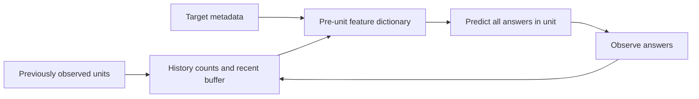
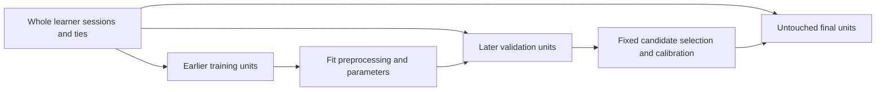

# As-of features and leakage rules

Features are emitted before the target answer and before every answer in a coupled session or timestamp-tie unit. Units merge overlapping session spans. The current answer, current duration, later outcomes, and future item priors are prohibited. Attempt kind and supplied skill tags are pre-answer metadata.

History features include learner/item rates, recent rates, cold-start flags, skill indicators and prior counts, and known within-domain gaps. Missing gaps have a separate flag. Legacy data is partitioned into question-local domains. Vocabularies and max-absolute scales fit training rows only and are serialized exactly.

`preprocessing.json` records model, prior, vocabulary, scaling, hyperparameter, and calibration fitting scopes against the split hash. Final test identities are absent from all scopes. Feature names use an explicit registry; dependency checks reject same-unit and future answers. Prefix-invariance tests flip all current and future outcomes and require identical pre-target dictionaries.

Learner-held-out splits keep entire learners separate. Rolling folds advance within known order domains. Parameters stay frozen during evaluation; an explicit option permits earlier observed evaluation answers to update later online state. Cold and warm learner/item slices are reported separately.
