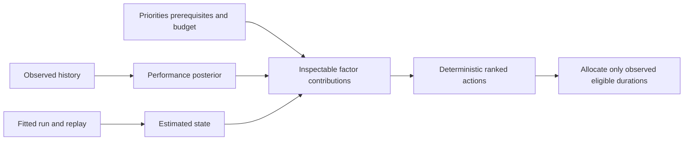

# Study planning and simulation

The observed-data planner ranks available questions using performance deficit, posterior interval width, recent repetition, user priorities, and optional fitted BKT prediction deficit. Prerequisites use supplied structure and observed lower bounds. Unknown or bundle-level item durations remain unallocated suggestions. Known time allocation uses the learner/item median with its observation count and quartiles.

Simulation is a separate seeded binary latent environment. Policies receive answer-conditioned beliefs, never latent state. Random, weak-skill-first, uncertainty, spaced, and budget policies share environmental random numbers for paired comparisons. Equal question and equal time budgets are checked independently.

The campaign runs nominal learning, slow learning, forgetting, and a deliberately misspecified process. In the last regime, true transition and response parameters differ from the policy assumptions. Thirty independent seeds per policy/regime retain all trajectories and outcome distributions in Parquet. The UI also supports smaller exploratory runs and displays their exact configuration.

The [simulation engine](../src/metricon/simulation/engine.py) accepts optional progress and cancellation callbacks. Progress reports completed policy trials with an explicit denominator. Cancellation checks seed and action boundaries and raises before a partial outcome can be returned or published. These callbacks consume no random numbers and preserve the same seeded outcomes when no cancellation occurs. The task worker connects them to persisted progress and the coordinator's control file; a real process regression checks cooperative exit and absence of a published simulation artifact.

Simulation gains depend on these assumptions and are not evidence of improvement in real learners. Logged observational answers cannot identify study-policy effects without a valid counterfactual design.
