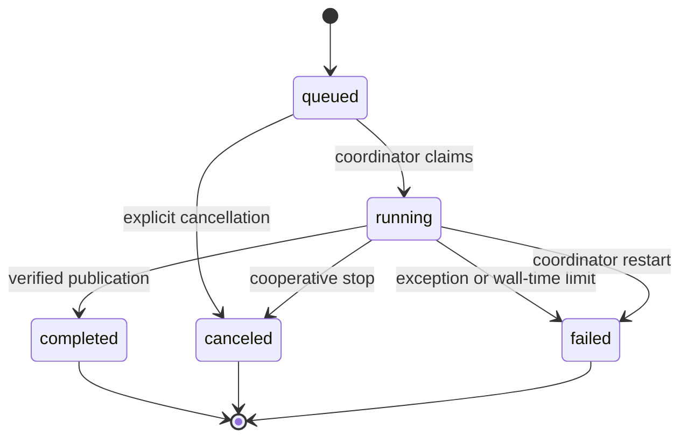

# Task and recovery runbook

The API process owns SQLite task state and publication. Two bounded subprocesses execute by default, with a maximum configuration of four. Workers open catalog connections in read-only mode and return immutable output manifests. The coordinator checks hashes before registering artifacts or advancing dataset pointers. Imports to the same workspace execute serially.



A task has a default one-hour wall-time budget. Cancellation creates a control file checked between chunks and fits. Simulation checks it before each seed allocation and each action, including long trials. After five seconds without exit, the coordinator terminates the task process group. Simulation progress counts completed policy trials against repetitions times policies; each trial includes its configured budget. It occupies the first 90 percent of task progress, leaving output writing and coordinator publication separate. Reported progress records completed work, never timer-based animation. Logs, requests, and complete worker responses remain under the ignored `task-runtime` directory.

Workers monitor the owning parent. Parent death terminates orphan workers, leaving staging files for reconciliation. On restart, run `metricon reconcile` before starting the service. It holds exclusive coordinator and operations locks, removes unregistered directories, and preserves committed datasets and artifacts. Running tasks become failed with an interruption message and require explicit resubmission. Queued tasks remain queued.

The publication boundary is the SQLite commit. A renamed directory alone is not visible data. Cancellation before coordinator publication leaves the previous workspace pointer intact. If a direct CLI import completes its transaction before interruption, the complete new dataset remains visible and a retry is idempotent.

The service retains compatibility with the `/api/jobs` routes. Status values are `queued`, `running`, `completed`, `failed`, and `canceled`; historical status names migrate at coordinator start. This is a local single-user service, not an authenticated multi-user deployment.

## Diagnose and retry

Inspect the task error and `.metricon/task-runtime/<job-id>` request, progress and response files. A parse error, eligibility failure, canceled process or wall-time termination has no success result ID. Resubmitting uses the original immutable upload and the workspace's current committed parent. An unchanged source/adapter import retry returns its original report; a new source with repeated event identities deduplicates them exactly.

Import dataset, identity index, pointer, report and import lineage registrations share one SQLite transaction. Experiment artifact registration precedes the remaining experiment lineage registration and terminal task update. A crash in that later interval can leave a complete valid artifact alongside an interrupted task. It cannot expose a half-written artifact. Inspect and verify that artifact before deciding to rerun. The coordinator does not claim that every task completion field and every lineage edge commit atomically together.

Query spill directories are connection-owned. Normal connection closure removes them. An abrupt process kill can leave an orphan directory under `query-temp`; after stopping the service and all CLI queries, those temporary directories can be removed. They are not canonical data or model artifacts.

## Local backup and restore

Stop the service and active CLI operations first. Use SQLite's backup interface for a consistent catalog and copy the immutable dataset/artifact directories, uploads and licensed source references from the same stopped store. Preserve dependency locks and the experiment source snapshots as well. A raw copy of an active SQLite file without its WAL is not a consistent metadata backup.

```bash
.venv/bin/python - <<'PY'
import sqlite3
from pathlib import Path
target = Path('../metricon-backup')
target.mkdir(exist_ok=True)
with sqlite3.connect('.metricon/catalog.sqlite') as source:
    with sqlite3.connect(target / 'catalog.sqlite') as destination:
        source.backup(destination)
PY
```

Keep the backup outside tracked source and apply the same data-license restrictions. Restore its matching immutable directories into an empty local store, run `metricon --root RESTORED reconcile`, then audit selected dataset checksums and `verify-artifact` on selected runs. Restoring only the catalog without its referenced files fails integrity checks. Reconciliation removes orphans and does not reconstruct missing committed files.
