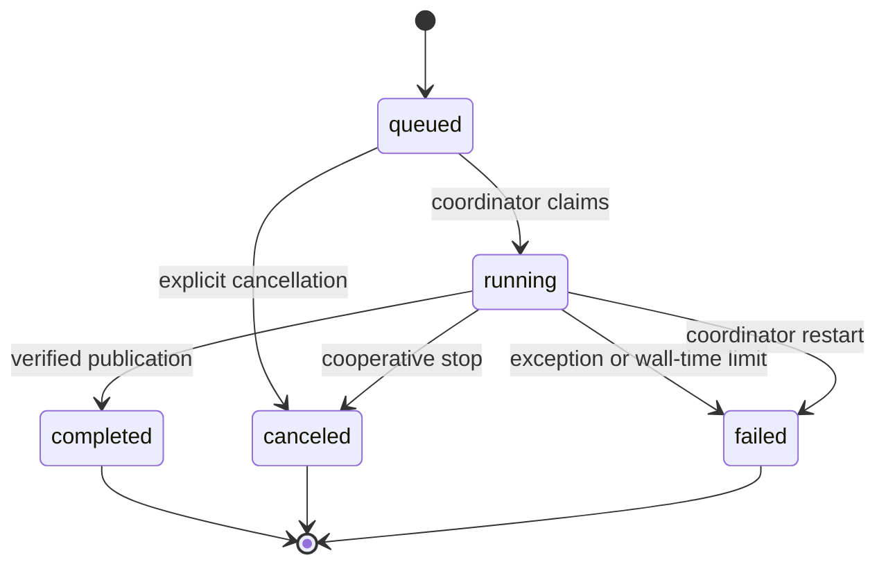

# Task and recovery runbook

The API process owns SQLite task state and publication. Two bounded subprocesses execute by default, with a maximum configuration of four. Workers open catalog connections in read-only mode and return immutable output manifests. The coordinator checks hashes before registering artifacts or advancing dataset pointers. Imports to the same workspace execute serially.

A task has a default one-hour wall-time budget. Cancellation creates a control file checked between chunks and fits. After five seconds without exit, the coordinator terminates the task process group. Reported progress records completed chunks and model work, never timer-based animation. Logs, requests, and complete worker responses remain under the ignored `task-runtime` directory.

Workers monitor the owning parent. Parent death terminates orphan workers, leaving staging files for reconciliation. On restart, run `metricon reconcile` before starting the service. It holds exclusive coordinator and operations locks, removes unregistered directories, and preserves committed datasets and artifacts. Running tasks become failed with an interruption message and require explicit resubmission. Queued tasks remain queued.

The publication boundary is the SQLite commit. A renamed directory alone is not visible data. Cancellation before coordinator publication leaves the previous workspace pointer intact. If a direct CLI import completes its transaction before interruption, the complete new dataset remains visible and a retry is idempotent.

The service retains compatibility with the `/api/jobs` routes. Status values are `queued`, `running`, `completed`, `failed`, and `canceled`; historical status names migrate at coordinator start. This is a local single-user service, not an authenticated multi-user deployment.
