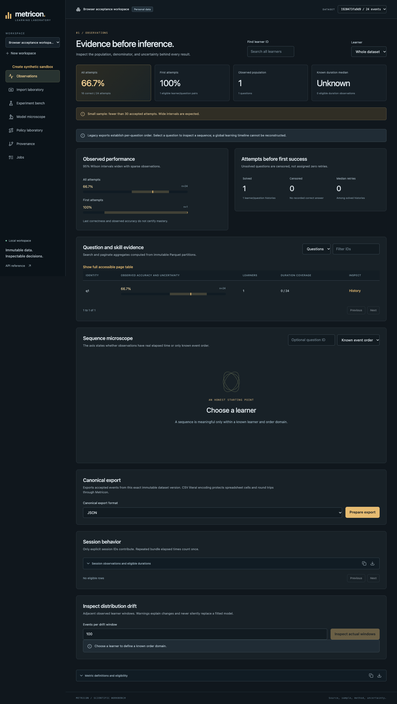
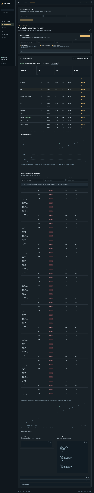
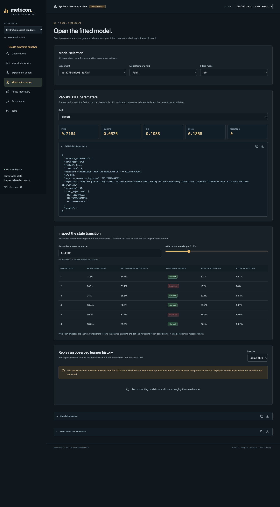
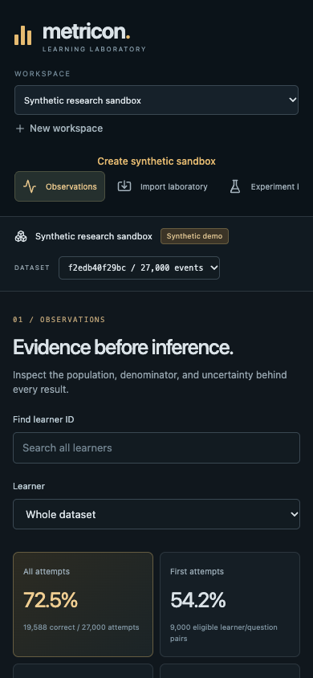

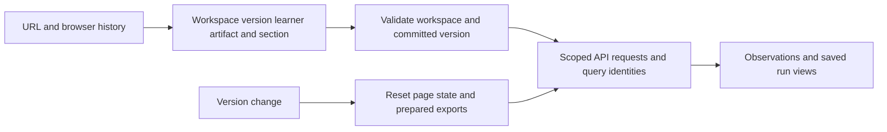

# Scientific workbench walkthrough

Run `make bootstrap` and `.venv/bin/metricon serve --port 8000`, then open [the local workbench](http://127.0.0.1:8000). The following images were captured from the running application during browser verification. They show an authored legacy fixture and an explicitly synthetic sandbox. No public learner history is redistributed in these screenshots.

## Inspect observations and their limits

Create a workspace and use Import laboratory to preview a source. Publish the import task, inspect its actual quality report, and open Observations. The authored fixture below has 24 accepted observations from one learner/question pair. Its duration is unknown, its first-attempt denominator is one, and the legacy source cannot establish a global timeline. The page keeps those limits visible. Rejection inspection is exercised before the screenshot in [the browser workflow](../web/e2e/workbench.spec.ts).

Question/skill search and learner selection issue real analytical requests through the [typed client](../web/src/api/client.ts). The complete accessible page table complements virtualized rows. Sequence charts state their order domain, and the export manifest identifies the immutable dataset included.

## Fit and compare experiments

Create the explicit synthetic sandbox, open Experiment bench, choose a split and submit fitting. Jobs reports actual process progress and supports cancellation. Completed runs expose raw and validation-calibrated metrics, cluster intervals, saved predictions and same-row comparisons. The screenshot uses the smaller browser verification population; the [research report](reports/RESEARCH.md) records the separately reproduced public and fixed synthetic campaigns.

## Examine the model mechanics

Model microscope reads exact saved parameters and diagnostics. Its illustrative answer sequence predicts before each answer, conditions afterward and applies the transition. The observed-history replay is explicitly retrospective and is separate from frozen held-out predictions. High latent probabilities remain model estimates.

Policy laboratory ranks actions from observed support, uncertainty, priorities and repetition. Timed allocation requires eligible observed durations. Simulation results name their latent assumptions and remain conditional. Provenance traces dataset, split, source, fitted parameter and report dependencies rather than treating an attractive chart as research evidence.

## Use the smaller layout

Navigation, forms, notices and table alternatives remain usable at the verified mobile viewport. Long immutable IDs wrap. Keyboard activation and accessible chart alternatives are covered by the browser workflow.

The [responsive workflow](../web/e2e/responsive.spec.ts) checks 320 through 1440 pixel widths under laptop Chromium, touch Chromium and mobile WebKit. These are browser emulations, not measurements on physical phones. Coarse-pointer controls retain usable touch targets and 16 pixel input text; reduced-motion preferences disable spinner animation. Timeline bins can be inspected by native selection, and calibration data has an expandable table.

The URL retains workspace, immutable dataset version, learner, artifact and section. Reload/back navigation restores these selections. A missing workspace or a version owned by another workspace produces an explicit state before any analytical scan. Switching versions clears prepared export links and model/page state. Experiment submissions pin the selected version; choosing a temporal fold changes saved prediction, calibration, comparison and replay requests together.

Offline/API failures expose retry, clipboard denial exposes download, and an unavailable interface module exposes reload. These recoveries do not publish new observations or research artifacts.

The [API reference](API_CLI.md), [metric glossary](METRICS.md) and [task runbook](TASKS.md) define the exact contracts behind these screens. Browser failures, screenshots and Playwright results remain in local `.metricon/verification/browser/` evidence after reproduction.
