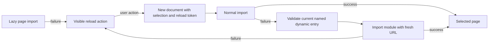

# Local client build and recovery

Status: accepted.

The Python package has two installation paths. Editable installation must work before ignored client assets exist, so the wheel build hook skips asset inclusion for editable builds. Distribution wheels require a compiled index and module manifest, then bundle the complete client alongside the exact dependency lock. This avoids a clean-clone CI failure while keeping an installed wheel self-contained.

The local service can serve a newly compiled client while a browser still holds older modules. Failed lazy imports need a visible recovery action. Browser failure injection showed that WebKit retained an aborted module import after ordinary reload and fresh-document navigation. HTTP cache disabling alone did not resolve it.

The workbench boundary offers explicit reload while preserving its selection URL. A reload token is read once before URL canonicalization. If a normal lazy import fails during that recovery document, the loader fetches the current build manifest, validates the named dynamic entry and retries its module with the reload token in the URL. Only a relative JavaScript file immediately under `assets/` is eligible. The expected named component must exist before rendering. A failed retry reaches the boundary again; there is no automatic reload loop.

Non-API client responses use `Cache-Control: no-store`. This trades local asset cache reuse for reliable rebuild visibility. React query caching and immutable data/model artifacts retain their separate contracts. Production browser checks abort a real module request, remove the interruption and activate reload in laptop Chromium, touch Chromium and mobile WebKit. API tests verify the asset headers, and installed-wheel verification checks the bundled manifest. Development-mode module recovery requires restarting/reloading the Vite server; the compiled manifest path is a production workbench contract.
