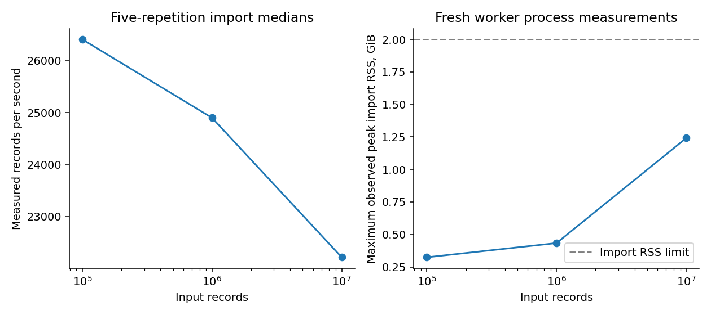

# Measured local performance

Import counts and memory meet the correctness gate. Canonical NDJSON throughput does not meet the 50,000 input records/second tuning objective. Aggregate query measurements and every failed objective remain visible. These are observations on one local machine, not service-level promises.

## Profile and method

The recorded host is Apple M2, eight physical/logical cores, 16 GiB RAM, macOS 26.7, arm64, Python 3.13.11. Background desktop applications were present. This is a local workstation profile, not a dedicated isolated benchmark machine. Raw hardware queries and environment versions are retained.

Each input size has five repetitions in fresh worker processes. DuckDB uses two configured threads; Polars reports two threads. The observed scikit-learn OpenMP pool uses one thread. OMP/OpenBLAS/MKL thread limits are requested as one; unreported native runtimes are not claimed to have been measured. Source snapshots and the exact dependency lock accompany each repetition.

Cold means a new worker/analytical connection. The OS file cache is not flushed. Warm repeats a query on the same analytical connection. Five observations per query/condition produce median and interpolated 95th percentile timings; a five-observation p95 has limited tail precision. DuckDB profiler bytes read are engine-reported reads, not a measurement of physical storage traffic. File/footer caching and projection can make them much smaller than source size.

Imports validate strict canonical rows, detect full-content duplicate/conflict identities, quarantine invalid rows, checksum/preserve the source, write immutable Parquet and commit the metadata pointer. Measured throughput includes those stages. The input population contains one duplicate, one conflicting identity and one rejected boolean per thousand records. Accepted rows retain complete normalized content verified against an independent streaming checksum/reference.

## Import and full feature materialization

| Input records | Accepted | Duplicate/conflict/rejected | Median records/s | Max import RSS GiB | Median Parquet MiB | Full features seconds |
| --- | --- | --- | --- | --- | --- | --- |
| 100,000 | 99,700 | 100/100/100 | 26,411 | 0.324 | 7.39 | 0.638 |
| 1,000,000 | 997,000 | 1,000/1,000/1,000 | 24,901 | 0.434 | 73.49 | 6.625 |
| 10,000,000 | 9,970,000 | 10,000/10,000/10,000 | 22,215 | 1.241 | 734.60 | 71.679 |

The import RSS bound is 2 GiB on this profile. Features cover every accepted row and respect unit boundaries. Feature time is separate from import time. Runtime files are retained for the final repetition of each size; earlier completed stores are removed after their raw measurements and manifests are saved. The checksummed source corpus can replay every repetition.

## Query distributions

| Input records | Query/condition | p50 ms | p95 ms |
| --- | --- | --- | --- |
| 100,000 | accuracy/connection-cold | 1.637 | 2.221 |
| 100,000 | accuracy/connection-warm | 1.422 | 1.535 |
| 100,000 | learner_history/connection-cold | 3.213 | 3.303 |
| 100,000 | learner_history/connection-warm | 3.111 | 3.292 |
| 100,000 | question_groups/connection-cold | 1.466 | 1.636 |
| 100,000 | question_groups/connection-warm | 1.317 | 1.371 |
| 100,000 | skill_groups/connection-cold | 2.607 | 2.680 |
| 100,000 | skill_groups/connection-warm | 2.556 | 2.620 |
| 1,000,000 | accuracy/connection-cold | 8.468 | 10.199 |
| 1,000,000 | accuracy/connection-warm | 7.976 | 9.455 |
| 1,000,000 | learner_history/connection-cold | 23.098 | 23.446 |
| 1,000,000 | learner_history/connection-warm | 23.097 | 23.734 |
| 1,000,000 | question_groups/connection-cold | 4.608 | 4.934 |
| 1,000,000 | question_groups/connection-warm | 4.648 | 4.839 |
| 1,000,000 | skill_groups/connection-cold | 15.671 | 16.031 |
| 1,000,000 | skill_groups/connection-warm | 15.860 | 16.424 |
| 10,000,000 | accuracy/connection-cold | 111.896 | 281.722 |
| 10,000,000 | accuracy/connection-warm | 75.241 | 82.523 |
| 10,000,000 | learner_history/connection-cold | 78.034 | 164.232 |
| 10,000,000 | learner_history/connection-warm | 57.510 | 60.877 |
| 10,000,000 | question_groups/connection-cold | 48.814 | 157.235 |
| 10,000,000 | question_groups/connection-warm | 39.190 | 41.128 |
| 10,000,000 | skill_groups/connection-cold | 145.504 | 164.171 |
| 10,000,000 | skill_groups/connection-warm | 154.471 | 190.365 |

The workloads scan count/accuracy, question aggregates, skill aggregates and a bounded learner history through immutable Parquet. See [exact SQL and measurement code](../../src/metricon/evaluation/benchmark.py). The 500 ms objective applies to the reported query p95 values; full history feature generation is a separate pipeline workload.

## Genuine fitted-model timing

The import worker's original four-history BKT timer mostly exercised sparse fallback and remains in its raw record. It is not reported here as an optimized model fit. A separate campaign selects eight fixed complete learner histories and optimizes two supported skills with two starts and at most 80 iterations. No history is truncated with a row limit. The five fresh-process repetitions per size retain exact fitted parameters, diagnostics, source and native thread inspection. These supported-history fits are small controlled fitting workloads, not full-data fit estimates.

| Source input records | Complete fitting rows | Learners/optimized skills | Global fit p50 ms | BKT fit p50 seconds | Max fit process RSS GiB |
| --- | --- | --- | --- | --- | --- |
| 100,000 | 80 | 8/2 | 0.033 | 0.1128 | 0.214 |
| 1,000,000 | 800 | 8/2 | 0.106 | 1.1253 | 0.259 |
| 10,000,000 | 8,000 | 8/2 | 1.100 | 4.6128 | 0.311 |

The actual EdNet experiment used all 118,288 training rows before model-specific eligibility restrictions. Its combined fit/predict/diagnostic runtime was 324.83 seconds. Its process-lifetime peak RSS was 1.748 GiB, including prior allocations. Per-model runtime includes fitting and prediction, not isolated optimizer time. BKT used 41.15 seconds; selected logistic used 11.02; 1PL used 8.12; 2PL used 8.84. [Research support and diagnostics](RESEARCH.md) explain what those models fitted.

The complete public experiment artifact occupies 210.35 MiB, including raw probabilities, parameters, source, exact lock and diagnostics. Acquisition archives and normalized source observations are separate.

The current campaign reused import/query and supported-history fitting measurements only after checking their unchanged measurement-module hashes, normalized corpus contents, dependency locks and preserved source snapshots. It reran the complete public experiment, then independently audited its frozen predictions. Changes to relevant measurement modules invalidate those cached repetitions.

## Failures, scope and reproduction

The earlier random text-key index measured a ten-million-record import at roughly 5,671 records/second. Its raw baseline remains local. A later feature-window workload exhausted process memory; the failed worker log remains retained. Spill-capable ordering replaced that unnecessary window. Earlier repetitions without native pool inspection remain historical evidence and were remeasured. Correcting these problems did not turn the unmet throughput target into a success.

`performance_targets_met` is `false`. System correctness and the synthetic prediction targets are evaluated separately. Optimization beyond these measurements must retain strict normalization, identity correctness, crash safety and the same workload population.

```bash
make benchmark
make acceptance
make verify
```

[Derived performance JSON](data/performance.json), [all import repetitions](data/imports.csv), [all query conditions and profiler reads](data/queries.csv), and [all supported-history fit repetitions](data/fits.csv) are safe aggregate reports. Local [raw benchmark](../../.metricon/benchmark/benchmark.json), `.metricon/benchmark/repetition-*.json`, `worker-*.log`, `fitting/fit-*.json`, `source-snapshots/` and `corpora/*.manifest.json` retain full proof. Ignored local artifacts become available after reproduction. The [storage contract](../ARCHITECTURE.md) and [recovery runbook](../TASKS.md) explain publication and ownership.


## Generated figures



Five-repetition import medians and maximum import RSS at each scale. Cold/warm query methods and unsuccessful performance objectives remain in the report. [Exact figure data](../figures/figure-data.json). Local [raw figure artifact](../../.metricon/artifacts/5d3b2f5ea0380d70217675a8972c8951a1d1752f298677d317012f431fab8e66/figure-data.json) links to run `ac4181703218341c266bded20269011ecfa7a759bfb40ad39701af1759d411fd` and dataset `38f4cea01effb1a41f07bf223b006e70167f55b409e85e0e4d17431bdf9ebcbe`.
