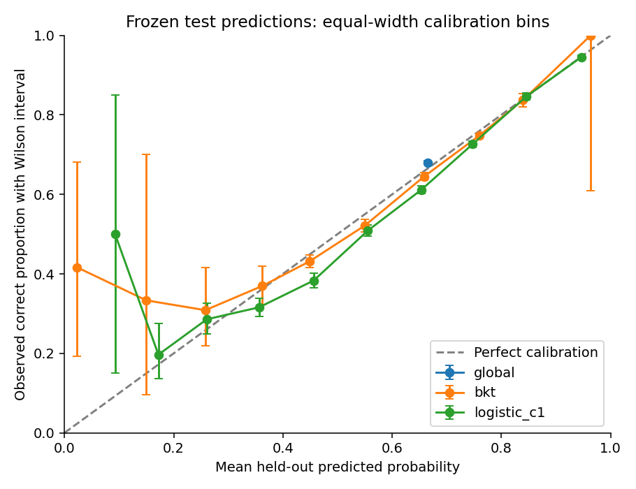
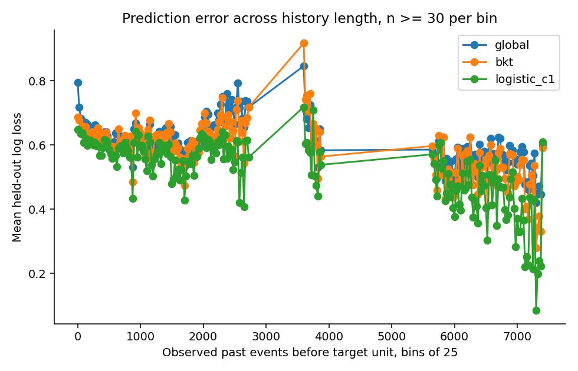
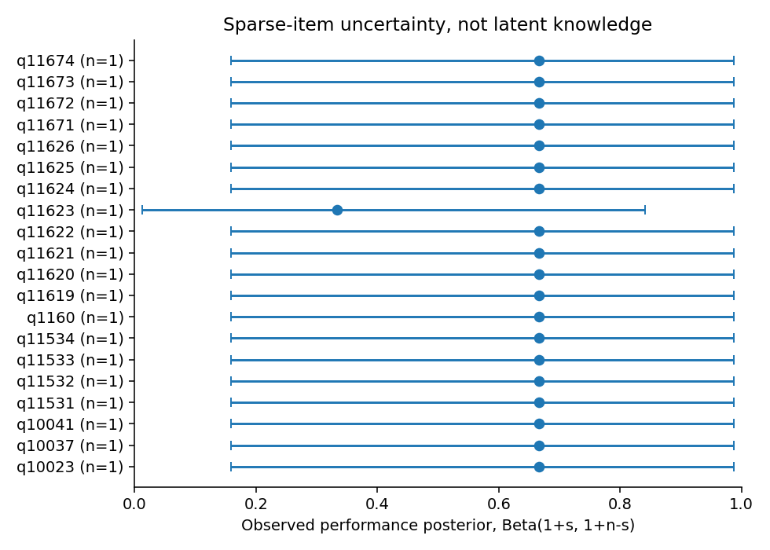
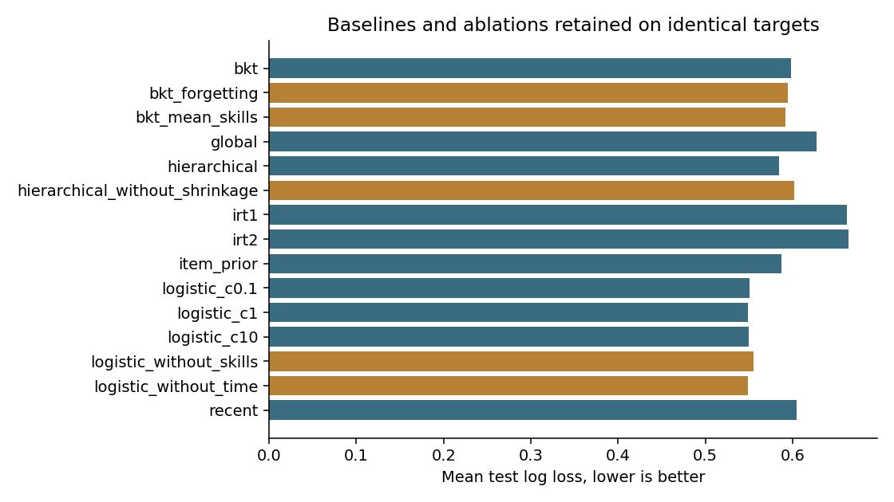

# Frozen prediction, calibration and negative results

On the deterministic EdNet subset, validation selected `logistic_c1`. Its raw held-out log loss is 0.549014, compared with 0.597889 for BKT and 0.627377 for the constant baseline. Both uncalibrated cohort IRT models fitted successfully and performed worse than the constant baseline on the same target rows. The full comparison is retained below.

## Population and protocol

The dataset contains 200,653 accepted interactions from 1,268 learners. Complete eligible source sequences were retained. [Acquisition, terms and exclusions](../PUBLIC_DATA.md) describe the deterministic learner selection and answer/content join. Timestamps are shifted question-presentation times. Bundles remain coupled units, and bundle duration is not repeated per question.

The forward split contains 118,288 training, 39,405 validation and 42,960 untouched test rows. Every displayed model uses the same 42,960 test targets, including 29,210 positive answers (67.99 percent). Whole session/timestamp units remain together. Vocabulary, scaling, priors and parameters fit only on training. The fixed logistic candidates are C=0.1, 1 and 10. Selection and Platt calibration use validation only.

Model parameters remain frozen. Observed validation/test answers may update state for later units; answers from the current unit cannot affect its predictions. [As-of rules](../FEATURES.md) explain this warm online protocol and separate learner-held-out/rolling modes. Unknown learner/item combinations use documented fallbacks. The raw report retains history-length and per-skill/learner slices; they describe prediction behavior rather than a causal learning effect. History-length bins have changing learner and item composition; the plotted connections do not imply observations in intervening empty bins.

Uncertainty uses 200 learner-cluster bootstrap draws, seed 2026, preserving whole histories. The test contains 1,268 learner clusters. Intervals below are percentile 95 percent intervals for log loss. Pairwise differences use identical rows and paired cluster resampling. AUROC requires both classes. ECE uses ten equal-width probability bins, weighted by eligible count. Empty bins are unknown.

## All fitted comparisons

| Model | Log loss | 95% cluster interval | Brier | AUROC | Accuracy | ECE |
| --- | --- | --- | --- | --- | --- | --- |
| bkt | 0.597889 | [0.569762, 0.631589] | 0.204578 | 0.644594 | 0.6943 | 0.013913 |
| bkt_forgetting | 0.594395 | [0.567047, 0.626767] | 0.203267 | 0.655522 | 0.6928 | 0.008345 |
| bkt_mean_skills | 0.591624 | [0.564621, 0.624285] | 0.202034 | 0.664731 | 0.6976 | 0.020567 |
| global | 0.627377 | [0.605658, 0.652692] | 0.217826 | 0.500000 | 0.6799 | 0.014232 |
| hierarchical | 0.584403 | [0.555193, 0.616476] | 0.199210 | 0.674859 | 0.6986 | 0.006720 |
| hierarchical_without_shrinkage | 0.602112 | [0.579601, 0.628167] | 0.207240 | 0.661647 | 0.6899 | 0.053163 |
| irt1 | 0.662562 | [0.656784, 0.668374] | 0.235945 | 0.578305 | 0.7060 | 0.156634 |
| irt2 | 0.663779 | [0.657101, 0.669885] | 0.236187 | 0.581522 | 0.7055 | 0.158391 |
| item_prior | 0.587599 | [0.562675, 0.615385] | 0.200368 | 0.671726 | 0.6982 | 0.023927 |
| logistic_c0.1 | 0.550238 | [0.520680, 0.587124] | 0.186895 | 0.735517 | 0.7119 | 0.031003 |
| logistic_c1 | 0.549014 | [0.519478, 0.585151] | 0.186341 | 0.735929 | 0.7145 | 0.026911 |
| logistic_c10 | 0.549888 | [0.520196, 0.585687] | 0.186586 | 0.734510 | 0.7148 | 0.027486 |
| logistic_without_skills | 0.554841 | [0.524436, 0.591083] | 0.189077 | 0.729683 | 0.7078 | 0.033427 |
| logistic_without_time | 0.549131 | [0.519793, 0.584851] | 0.186330 | 0.735928 | 0.7142 | 0.027406 |
| recent | 0.604293 | [0.571114, 0.641862] | 0.206185 | 0.655758 | 0.6916 | 0.049709 |

## Calibration and ablations

Raw and validation-calibrated test values are reported together. Calibration is not guaranteed to improve a held-out score. Forgetting and multi-skill pooling are separately named variants. The unpooled estimator tests hierarchical shrinkage; the logistic variants remove skill tags or pre-target temporal features. Small differences are observations, not significance claims. No model was omitted because it lost.

| Model | Raw log loss | Calibrated log loss | Raw ECE | Calibrated ECE |
| --- | --- | --- | --- | --- |
| bkt | 0.597889 | 0.597981 | 0.013913 | 0.010082 |
| bkt_forgetting | 0.594395 | 0.594772 | 0.008345 | 0.013720 |
| bkt_mean_skills | 0.591624 | 0.590227 | 0.020567 | 0.014639 |
| global | 0.627377 | 0.626951 | 0.014232 | 0.003767 |
| hierarchical | 0.584403 | 0.584486 | 0.006720 | 0.009397 |
| hierarchical_without_shrinkage | 0.602112 | 0.591316 | 0.053163 | 0.014396 |
| irt1 | 0.662562 | 0.609008 | 0.156634 | 0.044839 |
| irt2 | 0.663779 | 0.608101 | 0.158391 | 0.040130 |
| item_prior | 0.587599 | 0.585874 | 0.023927 | 0.007113 |
| logistic_c0.1 | 0.550238 | 0.548149 | 0.031003 | 0.018469 |
| logistic_c1 | 0.549014 | 0.547579 | 0.026911 | 0.017788 |
| logistic_c10 | 0.549888 | 0.548595 | 0.027486 | 0.017801 |
| logistic_without_skills | 0.554841 | 0.552566 | 0.033427 | 0.020264 |
| logistic_without_time | 0.549131 | 0.547751 | 0.027406 | 0.017286 |
| recent | 0.604293 | 0.593081 | 0.049709 | 0.010646 |

Same-row paired differences against the constant baseline, raw predictions:

| Model | Log loss difference | 95% paired interval |
| --- | --- | --- |
| bkt | -0.029488 | [-0.041292, -0.016888] |
| bkt_forgetting | -0.032982 | [-0.044186, -0.022088] |
| bkt_mean_skills | -0.035753 | [-0.046169, -0.023667] |
| hierarchical | -0.042974 | [-0.050651, -0.035132] |
| hierarchical_without_shrinkage | -0.025265 | [-0.034034, -0.017457] |
| irt1 | 0.035185 | [0.013012, 0.054015] |
| irt2 | 0.036402 | [0.014960, 0.054874] |
| item_prior | -0.039778 | [-0.044933, -0.035177] |
| logistic_c0.1 | -0.077139 | [-0.091268, -0.058380] |
| logistic_c1 | -0.078363 | [-0.093407, -0.060134] |
| logistic_c10 | -0.077489 | [-0.092960, -0.059457] |
| logistic_without_skills | -0.072536 | [-0.087190, -0.052940] |
| logistic_without_time | -0.078246 | [-0.093518, -0.060063] |
| recent | -0.023084 | [-0.041402, -0.005239] |

## Diagnostics and limitations

BKT genuinely optimized 103 supported skill models; 103 reported convergence. Sparse skills retain an explicit prior fallback. Boundary parameters and every multi-start objective remain in the fitted artifact. For multi-skill/bundled observations, the fitted objective is a marginal composite log score with delayed conditioning. A latent posterior is conditional on that process and is not a certified assessment.

The IRT training support core retained 48,644 of 118,288 training observations across 520 learners and 1,219 items. Unsupported rows/items/learners cannot produce cohort difficulty claims. Both 1PL and 2PL converged. Validation calibration reduced their test log losses to 0.609008 and 0.608101, respectively, improving on the calibrated constant while remaining worse than the selected logistic model. They predict all common held-out targets with fallbacks outside their support core. Their poor held-out log losses expose a limitation of this static regularized cohort formulation and its coverage; higher accuracy does not repair bad probability quality. Conditional curvature diagnostics do not constitute a joint parameter posterior.

This subset is one deterministic capped research population. It is not a population-wide EdNet estimate, a causal comparison of study policies, or an external validation of mastery. Historical selection, correlated practice and new-item coverage remain limitations. Skill coefficients describe associations. Shifted dates cannot support real calendar claims. Temporal features require question-presentation timestamps; other source formats must satisfy the stated pre-answer availability assumption.

## Fixed identifiable synthetic checks

Each fixed dataset has 27,000 complete-sequence observations from 300 learners, three skills and 5,400 held-out targets. The generator uses initial=0.2, learning=0.1, slip=0.1, guess=0.2 and no forgetting. Latent states are not supplied to the fitting pipeline. These workloads test an identifiable known process; they do not substitute for public research.

| Seed | Constant loss | BKT loss | Relative improvement | Target met |
| --- | --- | --- | --- | --- |
| 17 | 0.523278 | 0.345962 | 33.89% | True |
| 41 | 0.522883 | 0.347809 | 33.48% | True |
| 73 | 0.519450 | 0.336084 | 35.30% | True |
| 101 | 0.530053 | 0.336590 | 36.50% | True |
| 137 | 0.518187 | 0.328680 | 36.57% | True |

## Policy simulation

The separate simulator ran 1,200 outcomes across four regimes, five policies, both budget modes and 30 seeds per cell. All trajectories are retained. The common budgets are 15 questions or 900 seconds. This campaign assigns each simulated action 60 seconds, so the two budget modes intentionally have the same action allowance. They do not represent distinct time-cost regimes.

The table shows the adaptive `budget` policy minus random review in final simulated latent known fraction, using matched environmental seeds. Every interval below includes zero. This campaign does not establish a reliable policy benefit. The misspecified regime uses a different latent process from the planner's assumptions. Observed logged answers are never treated as a counterfactual policy trial.

| Regime | Budget | Mean difference | 95% Monte Carlo interval |
| --- | --- | --- | --- |
| nominal | questions | 0.077778 | [-0.024609, 0.180164] |
| nominal | time | 0.077778 | [-0.024609, 0.180164] |
| slow_learning | questions | 0.000000 | [-0.076730, 0.076730] |
| slow_learning | time | 0.000000 | [-0.076730, 0.076730] |
| forgetting | questions | 0.088889 | [-0.004737, 0.182515] |
| forgetting | time | 0.088889 | [-0.004737, 0.182515] |
| misspecified | questions | 0.033333 | [-0.093329, 0.159996] |
| misspecified | time | 0.033333 | [-0.093329, 0.159996] |

## Reproduce and inspect

```bash
make dataset-public
make experiment
make acceptance
make verify
```

Dataset: `38f4cea01effb1a41f07bf223b006e70167f55b409e85e0e4d17431bdf9ebcbe`. Run: `fc32b876155c76d34b1c27d890e1f47f46462b4ec8e0e2c3c65c92a785e68b4a`. Split: `15e20929462b53e29eedcc9ba90e189a06729b08851ed3bb40ddcc6a8cdaf827`. Seed: `2026`. Exact retained lock SHA-256: `5526ba82db10198642af4d4c083981df4f91f6b5cda6690e05cf86d21346dba5`. Python: 3.13.11.

The [aggregate machine-readable report](data/research.json) and [model table](data/models.csv) contain derived metrics, population counts, intervals, hashes and seeds. They contain no raw learner records. Local raw evidence includes [the run report](../../.metricon/artifacts/fc32b876155c76d34b1c27d890e1f47f46462b4ec8e0e2c3c65c92a785e68b4a/report.json), [frozen predictions](../../.metricon/artifacts/fc32b876155c76d34b1c27d890e1f47f46462b4ec8e0e2c3c65c92a785e68b4a/fold-0/predictions.parquet), [split assignments](../../.metricon/artifacts/fc32b876155c76d34b1c27d890e1f47f46462b4ec8e0e2c3c65c92a785e68b4a/fold-0/split.json), [preprocessing scopes](../../.metricon/artifacts/fc32b876155c76d34b1c27d890e1f47f46462b4ec8e0e2c3c65c92a785e68b4a/fold-0/preprocessing.json) and the run's `dependency.lock`. Ignored artifacts become available after local reproduction.

The implementation walkthrough follows [temporal splits](../../src/metricon/evaluation/splits.py), [as-of history](../../src/metricon/features/history.py), [BKT fitting/inference](../../src/metricon/models/bkt.py), [cohort restrictions](../../src/metricon/models/irt.py), [frozen evaluation](../../src/metricon/evaluation/frozen.py) and [cluster resampling](../../src/metricon/evaluation/metrics.py). [Model cards](../MODEL_CARDS.md) retain interpretation limits. [Scientific/source review](REVIEW.md) records discovered failures and their remediation.


## Generated figures



Frozen test probabilities with ten equal-width bins. Wilson bars are marginal bin summaries and do not account for within-learner dependence. Cluster loss intervals are reported separately. [Exact figure data](../figures/figure-data.json). Local [raw figure artifact](../../.metricon/artifacts/633449709e11a18a3dc650abaecbf8367f76ca098054c2dea7f3025c591e7c0d/figure-data.json) links to run `fc32b876155c76d34b1c27d890e1f47f46462b4ec8e0e2c3c65c92a785e68b4a` and dataset `38f4cea01effb1a41f07bf223b006e70167f55b409e85e0e4d17431bdf9ebcbe`.



Held-out prediction error by prior observed history length. Bins require at least 30 targets. This is an association across history lengths, not an estimated causal learning curve. [Exact figure data](../figures/figure-data.json). Local [raw figure artifact](../../.metricon/artifacts/633449709e11a18a3dc650abaecbf8367f76ca098054c2dea7f3025c591e7c0d/figure-data.json) links to run `fc32b876155c76d34b1c27d890e1f47f46462b4ec8e0e2c3c65c92a785e68b4a` and dataset `38f4cea01effb1a41f07bf223b006e70167f55b409e85e0e4d17431bdf9ebcbe`.



Twenty sparse observed items with Beta(1+s, 1+n-s) performance uncertainty and explicit counts. These intervals do not measure latent skill knowledge. [Exact figure data](../figures/figure-data.json). Local [raw figure artifact](../../.metricon/artifacts/633449709e11a18a3dc650abaecbf8367f76ca098054c2dea7f3025c591e7c0d/figure-data.json) links to run `fc32b876155c76d34b1c27d890e1f47f46462b4ec8e0e2c3c65c92a785e68b4a` and dataset `38f4cea01effb1a41f07bf223b006e70167f55b409e85e0e4d17431bdf9ebcbe`.



Every eligible raw model and named ablation on the same held-out targets. All baselines remain visible, including models that outperform BKT and poor cohort IRT results. [Exact figure data](../figures/figure-data.json). Local [raw figure artifact](../../.metricon/artifacts/633449709e11a18a3dc650abaecbf8367f76ca098054c2dea7f3025c591e7c0d/figure-data.json) links to run `fc32b876155c76d34b1c27d890e1f47f46462b4ec8e0e2c3c65c92a785e68b4a` and dataset `38f4cea01effb1a41f07bf223b006e70167f55b409e85e0e4d17431bdf9ebcbe`.
